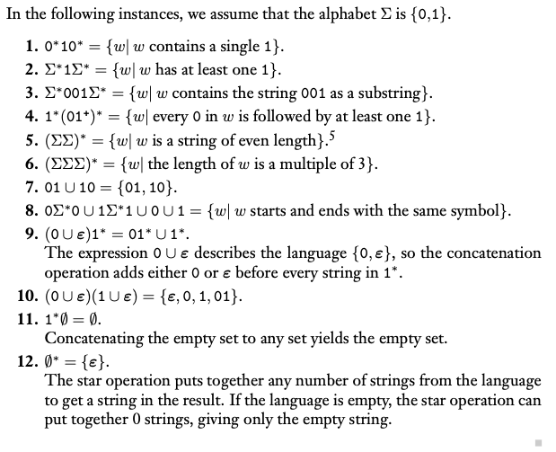
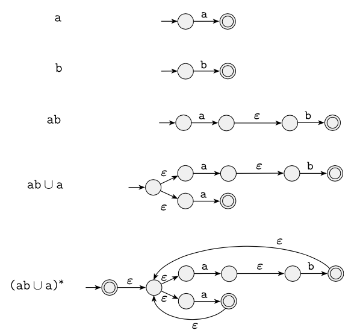
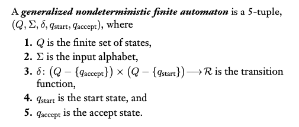
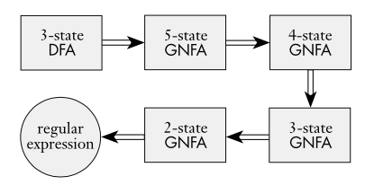
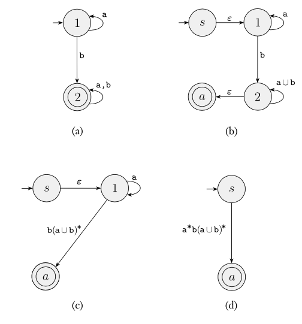

### 1.3 Regular Expression, RE 正則表達式

- 介紹：RE使用字串來表達一系列符合規則的規則的字串，時常用於尋找與替代，像vim、linux的grep指令都是典型的例子

- 定義：具體意義參照1.1講義
  1. 文字字符：$a\ in\ Σ$
  2. 空字串：$ε$
  3. 空集合：$∅$
  4. 聯集
  5. 字串串接
  6. Kleene *
  - 為避免括號，優先級：Kleene * > 字串串接 > 聯集

- 圖解：

- RE跟有限自動機必等價
  - RE to NFA: （證明可參照1.2）
    - Thompson算法（個人補充、部分參照圖解）
      1. 畫出$a\ in\ Σ$、$ε$、$∅$、聯集、串接、Kleene *的圖形，說明這些正則式可轉換正規語言
      2. 以上運算符合封閉性，因此由這些運算組成的正則式，亦等價於正規語言
      3. 已證明DFA和NFA等價，因此RE亦等價於DFA
      
      

  - DFA to GNFA to RE:
    - GNFA: 
      1. 推廣非決定性狀態有限自動機 
      2. 僅有一個起始狀態、一個接受狀態
      3. 轉移函式接受字符、空字串、空集合、正則式
      4. 原文定義:
      
       
       
    - DFA to GNFA:
      1. 直接加入頭尾兩個空字串連接的狀態（起始、接受）
      2. 參照圖解(a), (b)
    - GNFA to RE:
      1. 一次減少一個狀態，更新其他的轉移函示（每個都要更新）
      2. 直到剩下新加入的起始跟接受狀態時，其轉移函式即為RE
      
      
      
      

