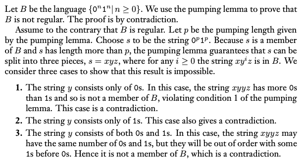

### 1.4 Nonregular Languages

- Pumping Lemma  泵定理
  - 假設$L \subseteq \Sigma^*$為正規語言，存在字串$w \in L$且$|w| \geq n$（$n$為泵長度，可視為等價DFA的狀態數）
  - 若$s \in L$，必可拆分為$s = xyz$
    1.   $xy^iz \in L,\ for\ each\ i \geq 0$
    2. $|y| \geq 1$
    3. $|xy| \leq n$
  - 證明：鴿籠理論
    1. $|w| \geq n$：DFA狀態數小於字串長度
    2. 在字串讀入前$n$個字符，必有一個狀態到達兩次以上
    3. 顯然 $δ^∗(s, x) = δ^∗(s, xy)$
    4. 推廣出 $δ^∗(s, xyz) ∈ L \leftrightarrow δ^∗(s, xy^iz) ∈ L$
  - 反證：
    1. 泵定理為正規語言的必要條件，但不充分，因此僅能反證不是正規
    2. 找到一個$i$，使得$xy^iz ∉ L$，也就是說和泵引理的第三條矛盾，即反證完成
  - 反證例子：

  
