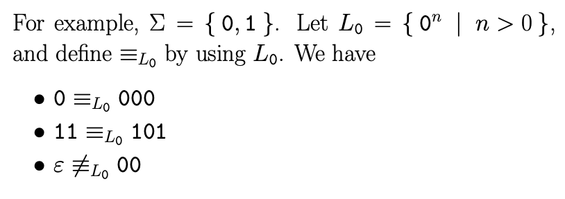

### 1.6 Myhill-Nerode Theorem

- Indistinguishable 不可區分
  - 定義：
    - 給定一個字母及$\Sigma$，以及其生成的語言$L \subseteq \Sigma^*$
    - 給定兩字串$x, y \in \Sigma^*$，若對所有後綴字串$z \in \Sigma^*$，$xz, yz$同時屬於或不屬於$L$，則此兩字串稱為不可區分，反之可區分
  - 性質：
    - 不可區分為等價關係，具備等價關係性質
      1. Reflexive
      2. Symmetric
      3. Transitive
    - 以自動機來看，一組等價的字串對應DFA上的一個狀態

- Myhill-Nerode Theorem
  - $L$為正規語言，若且唯若$\equiv_L$的等價類數目是有限的
  - 接受語言$L$的最小自動機狀態數目等於$\equiv_L$的等價類數目

- 與泵定理不同，Myhill-Nerode Theorem為正規語言的充要條件
 
